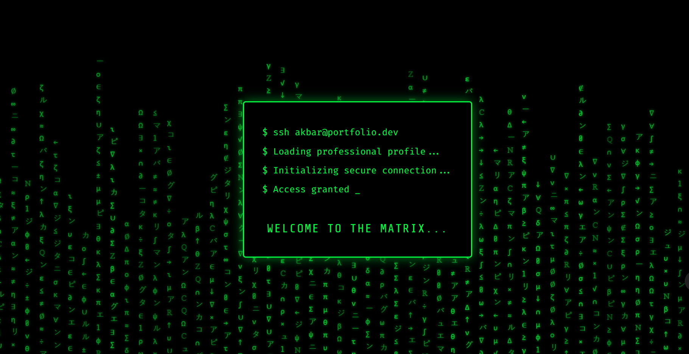

# Akbar Aman Portfolio Website

Welcome to the source code for [Akbar Aman’s Portfolio Website](http://localhost:8001/), a modern, interactive showcase for a Computer Engineer. This site is designed with a Matrix-inspired theme, featuring a terminal CLI, smooth animations, and responsive layouts.

---

## Live Demo & Deployment

This site is deployed using **Cloudflare Pages** for fast, secure, and global delivery. To deploy your own version:

1. Fork or clone this repository.
2. Push your code to a public GitHub repository.
3. Go to [Cloudflare Pages](https://pages.cloudflare.com/) and create a new project, connecting your GitHub repo.
4. Use the default build settings for static sites (no build command required).
5. Your site will be live at `https://<your-project>.pages.dev`.

---

## Technologies Used

- **HTML5** & **CSS3** (custom, modular, and responsive)
- **JavaScript** (vanilla, for interactivity and animations)
- **Font Awesome** (icon library)
- **Google Fonts** (Fira Code, Share Tech Mono)
- **Cloudflare Pages** (hosting)

---

## Browser Compatibility

Tested on latest versions of Chrome, Firefox, Edge, and Safari. Fully responsive and mobile-friendly.

---

## Accessibility

Efforts have been made to ensure:
- Sufficient color contrast
- Keyboard navigation for terminal CLI
- Semantic HTML structure
Further improvements are welcome!

---

## Screenshots



_Matrix-style loading screen from the portfolio website._

---

## Contributing

Contributions, suggestions, and improvements are welcome!

1. Fork the repository
2. Create a new branch (`git checkout -b feature-name`)
3. Commit your changes
4. Open a pull request

Please follow best practices and keep code modular and well-documented.

---

## Table of Contents

- [Features](#features)
- [Project Structure](#project-structure)
- [Installation & Usage](#installation--usage)
- [Customization](#customization)
- [Assets](#assets)
- [License](#license)
- [Contact](#contact)

---

## Features

- **Matrix-style Loading Screen**: Animated intro with terminal-like messages.
- **Interactive Terminal CLI**: Simulated command-line interface for user interaction.
- **Quick Actions**: Download resume, scroll to top, open terminal.
- **Responsive Design**: Mobile-friendly layouts and navigation.
- **Modern UI**: Custom fonts, icons, and visual effects.
- **Downloadable Resume**: PDF available in the assets.

---

## Project Structure

```
index.html                # Main HTML file
assets/
	css/
		styles.css            # Global styles
		components.css        # UI components (nav, buttons, etc.)
		responsive.css        # Mobile responsiveness
		styles_new.css        # (Alternate/experimental styles)
		components_new.css    # (Alternate/experimental components)
		responsive_new.css    # (Alternate/experimental responsive)
	files/
		Akbar_Resume.pdf      # Downloadable resume
		neo.png               # Profile image
	js/
		animations.js         # Matrix rain, loading, and other animations
		main.js               # Main site logic, event handlers
		modals.js             # Modal popups and overlays
LICENSE                   # License information
README.md                 # Project documentation
```

---

## Installation & Usage

1. **Clone the repository**:
	 ```bash
	 git clone https://github.com/ak23bar/portfolio-website.git
	 cd portfolio-website
	 ```

2. **Start a local server** (Python 3):
	 ```bash
	 python3 -m http.server 8001
	 ```
	 Visit [http://localhost:8001/](http://localhost:8001/) in your browser.

---

## Customization

- **Content**: Edit `index.html` to update profile info, skills, and sections.
- **Styles**: Modify CSS files in `assets/css/` for colors, fonts, and layout.
- **Scripts**: Enhance interactivity via JS files in `assets/js/`.
- **Resume**: Replace `Akbar_Resume.pdf` in `assets/files/` with your own.

---

## Assets

- **Fonts**: Uses [Fira Code](https://fonts.google.com/specimen/Fira+Code) and [Share Tech Mono](https://fonts.google.com/specimen/Share+Tech+Mono).
- **Icons**: [Font Awesome](https://fontawesome.com/) for UI icons.
- **Images**: Profile image (`neo.png`) and downloadable resume.

---

## License

See `LICENSE` for details.

---

## Professional Notes

- This portfolio is designed for high performance and modern aesthetics.
- All code is original and modular for easy maintenance.
- For deployment, Cloudflare Pages is recommended for its speed and reliability.

---

---

## Contact

For questions or collaboration, reach out via [LinkedIn](https://linkedin.com/in/akbaraman) or email (see website).

---

Feel free to further personalize this README to match your professional style or add more technical details! Let me know if you want to include screenshots, deployment instructions, or anything else.
